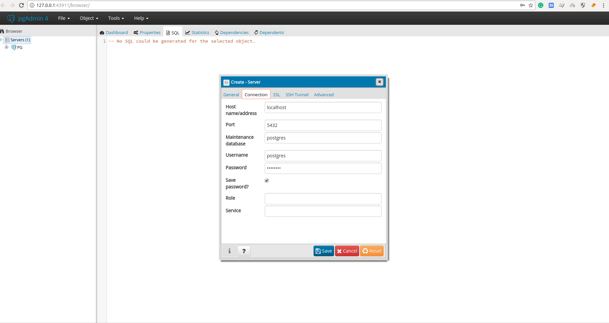

# Install postgresql on ubuntu 16.04

What is Postgresql?
--------
PostgreSQL is a Relational Database Management system which store, retrieves the information from the Postgresql Database.

Install PostgreSql
--------
- `$ sudo apt-get update`
- `$ sudo apt-get install postgresql postgresql-contrib`
- `$ sudo -u postgres psql postgres`
- postgres=# `\password postgres`
- Enter new password: `your_password`
- Enter it again: `your_password`
- Exit psql: `\q`

Install PgAdmin4
---------------
- [Download](https://www.pgadmin.org/download/pgadmin-4-python-wheel/)
- Unzip the zip file.
- `cd pgsql/pgAdmin 4/bin`
- Click on `pgAdmin4`. It will open an interface on browser (http://127.0.0.1:43911/browser/).
- Create connection

- Save connection.

Connect to PgSQL inside docker
---------------------------
Allow remote access

- Change pg_hba.conf: `$ sudo nano /etc/postgresql/10/main/pg_hba.conf`

```sh
local   all             postgres                                peer
host    all             all             127.0.0.1/32            md5
```

  Should be

```sh
local   all             postgres                                md5
host    all             all             0.0.0.0/0               md5
```

- Change postgresql.conf: `$ sudo nano /etc/postgresql/10/main/postgresql.conf`

```sh
#listen_addresses = 'localhost'
```

  Should be

```sh
listen_addresses = '*'
```

- Restart postgresql service: `$ sudo service postgresql restart`

--------------------------------------------------------------------


